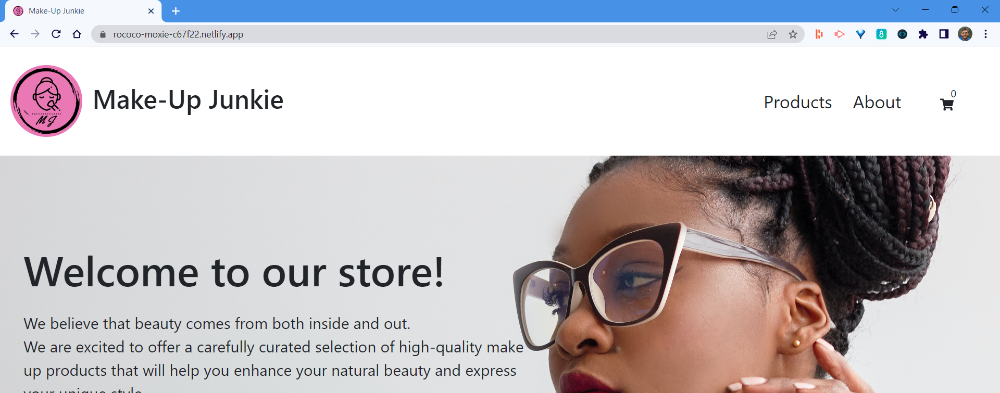

 

# eComReactApp

## Description

Make-Up Junkie is a responsive e-commerce website of make-up products where the user can see and buy products.

## Table of Contents

**[User Story](#user-story)** 
**[Functionality](#functionality)** 
**[Installation](#installation)** 
**[Technologies Used](#technologies-used)** 
**[Authors](#authors)** 

## User Story

As an online shopper  
I want to be able to easily browse products and make a purchase through an intuitive ecommerce app. 
I expect to view detailed product descriptions 
when clicked on the product. 
Once I've selected items to purchase 
I want to be able to add them to my cart and view summary of my order with total cost of my order displayed 
After making a purchase 
I expect to be redirected to a page confirming my order

## Functionality

Make-up Junkie eCommerce app provides an intuitive and seamless shopping experience for customers.

Here there are a few key functionalities:

- Product catalog 
  - the app displays a list of products from Api, including their prices, descriptions and images 
- Shopping cart 
  - user is able to add or remove products from the cart and proceed to checkout
- Customer support  
  - the provides customer contact information  
- Newsletter  
  - the app allows user to sign up for a newsletter 
- Responsive design  
  - the app is responsive and accessible on various devices including desktops, laptops, tablets and mobile phones 

## Installation

To run this project you will need Node at least v 18. You can install it using nvm. To check what version of the node of have use the following command.

`node -v`

If the version is earlier than 18.0.0 please install later version. After node installation please install yarn using the following command.

`npm i -g yarn`

Then go from the folder where this files lives you can restore packages and run the app.

`yarn`
`yarn dev`

## Usage

After opening this url:  https://rococo-moxie-c67f22.netlify.app/  
you should see this in your browser:

## Technologies Used

This project was built using [Node v18.x](https://nodejs.org/en) and uses following technologies:  

[Vite.js](https://vitejs.dev/) - for setting up development  
[Yarn](https://classic.yarnpkg.com/en/) - for dependency management  
[React.js](https://react.dev/) - for building the application  
[React Bootstrap](https://react-bootstrap.github.io/) - framework for styling

## Authors

### [@OlgaFelczak](https://github.com/OlgaFelczak)

### [@Pawel](https://github.com/Pav85)

### [@Alexander](https://github.com/PurAlex)

## Contributing

You need to fork this repository and submit a pull request.

## License

N/A

## Questions

If you have any questions about this project, open an issue or contact us directly:  
ofelczak@gmail.com  
pawel.werbowy@gmail.com  
nicky@email.com  
